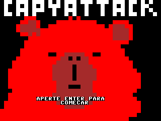

# Capybara-Attack
# SSC0119 - Prática em Organização de Computadores

Este repositório contém os projetos desenvolvidos durante a disciplina **SSC0119 - Prática em Organização de Computadores**, oferecida no ICMC/USP em 2025.

## 📂 Projetos

### 🧠 Processador
Implementação de um processador simples, com suporte a operações aritméticas, controle de fluxo e acesso à memória.

### 🎮 Capybara Attack
Jogo desenvolvido em Assembly para o processador da disciplina, onde o jogador controla um caçador que precisa se defender das capivaraas que o atacam, com base em inputs e lógica de movimentação. A movimentação do personagem é feita pelas teclas A,W,S,D e o tiro do caçador pode ser feito apertando a tecla de espaço. No jogo o objetivo é o caçador ficar o máximo de tempo vivo matando as capivaras que surgem e coletando as maças que
aparecem na tela que aumentam de 10 em 10 pontos o score quando coletadas.

---

## 📚 Autores

- **Nome:** Matheus Muzza Pires Ferreira **NUSP:** 15479468
- **Nome:** Matheus Muzza Pires Ferreira **NUSP:** 15479468
- **Curso:** Ciência da Computação - ICMC/USP

