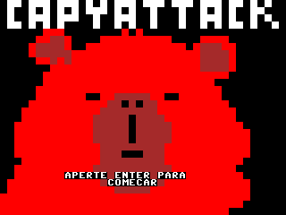

# Capybara-Attack
# SSC0119 - Prática em Organização de Computadores

Este repositório contém os projetos desenvolvidos durante a disciplina **SSC0119 - Prática em Organização de Computadores**, oferecida no ICMC/USP em 2025.

## 📂 Projetos

### 🧠 Processador
Construção do Hardware do Processador em VHDL na FPGAs, com suporte a operações aritméticas, controle de fluxo e acesso à memória.

### 🎮 Capybara Attack

#### 🧾 Objetivo do Jogo

O jogo foi desenvolvido em Assembly para o processador da disciplina, onde o jogador controla um caçador que precisa se defender das capivaras que o atacam.  
O objetivo é sobreviver o máximo de tempo possível, eliminando as capivaras que surgem na tela e coletando maçãs.  
Cada maçã coletada aumenta o score do jogador em 10 pontos.

#### 🎮 Jogabilidade

A movimentação do personagem é feita por meio das teclas:

- `W` - Cima
- `A` - Esquerda
- `S` - Baixo
- `D` - Direita

O tiro do caçador é disparado ao pressionar a tecla `SPACE`.

As capivaras surgem em diferentes posições e se movem em direção ao jogador, podendo ter até 5 capivaras presentes na tela ao mesmo tempo. O jogador deve evitá-las ou eliminá-las com tiros, ao mesmo tempo que coleta maçãs para aumentar sua pontuação.

### 🖼️ Capturas de tela do jogo

  
  

  <em>Tela inicial do jogo</em> &nbsp;&nbsp;&nbsp;&nbsp;&nbsp;&nbsp;&nbsp;&nbsp;&nbsp;&nbsp;
  <em>Tela final do jogo</em>

 
### Vídeo explicativo
https://youtu.be/WCKNNnHiErc

---

## 📚 Autores

- **Nome:** Matheus Muzza Pires Ferreira **NUSP:** 15479468
- **Nome:** João Pedro Castelli         **NUSP:** 15463450
- **Curso:** Ciência da Computação - ICMC/USP

